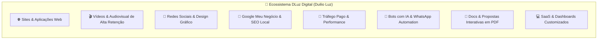

# 🚀 DLuz Digital (Duilio Luz) — Masterplan Estratégico & Catálogo de Serviços 360°

> **"Transformando Empresas com Marketing de Alta Performance, Tecnologia e Inteligência Artificial."**

---

## 💎 1. O Posicionamento Único da Marca: A Agência Tech & IA da Nova Era

A maioria das agências tradicionais é lenta, cobra caro, demora semanas para entregar um criativo e não entende nada de tecnologia, programação ou inteligência artificial.

A **DLuz Digital (Duilio Luz)** nasce com um diferencial competitivo imbatível:
- **Agilidade Extrema impulsionada por IA:** O que uma agência comum leva 1 mês para fazer, a DLuz Digital (Duilio Luz) entrega em dias com qualidade de estúdio e automações proprietárias.
- **DNA Técnico Real:** Não fazemos apenas "posts bonitinhos". Criamos ecossistemas completos: sites ultrarrápidos (padrão Google Stitch), bots inteligentes de atendimento 24/7 no WhatsApp, campanhas orientadas a dados e vídeos com retenção cinematográfica.
- **Foco em Lucro Real (ROI):** O cliente não quer métricas de vaidade (curtidas). Ele quer telefone tocando, WhatsApp apitando com clientes e faturamento no caixa.

---

## 🛠️ 2. Catálogo Oficial de Serviços para Empresas (Menu B2B)

---

### 🌐 1. Sites, Landing Pages & E-commerces de Elite
* **Landing Pages de Alta Conversão:** Páginas focadas 100% em vendas ou captação de leads. Construídas com código moderno e limpo (Astro 5 / Tailwind / Google Stitch) com carregamento instantâneo (95-100 no Google PageSpeed).
* **Sites Institucionais Modernos:** Portais corporativos responsivos, com arquitetura visual fluida, formulários inteligentes e integração direta com WhatsApp.
* **Lojas Virtuais & Catálogos Digitais:** E-commerces rápidos, com checkout transparente, gateways de pagamento (Pix instantâneo, cartão) e controle de estoque.
* **Manutenção & Hospedagem Gerenciada:** Servidores de alta velocidade com Cloudflare e segurança anti-quedas.

---

### 🎬 2. Produção de Vídeos Comerciais & Edição Cinética
* **Reels, Shorts & TikToks Virais para Empresas:** Edição dinâmica no padrão oficial DLuz (sem enrolação, gancho instantâneo no segundo 0, cortes ágeis e trocas de cena a cada 2-3s).
* **Motion Graphics & HyperFrames:** Animações fluidas de infográficos, textos cinéticos, selos de garantia e comparativos que prendem a atenção do cliente.
* **Sound Design Contextual (SFX & BGM Narrativa):** Efeitos sonoros sincronizados (cliques, digitações, transições mágicas e quedas de áudio dramáticas nos momentos sérios).
* **Vídeos Institucionais com B-Roll & Locução IA (OmniVoice):** Narração profissional e encorpada de alta fidelidade para apresentações corporativas, depoimentos e vídeos explicativos.
* **Dublagem e Tradução para Empresas Exportadoras:** Localização de vídeos institucionais para Inglês, Espanhol ou Mandarim com sincronia labial.

---

### 📍 3. Google Meu Negócio & SEO Local (Máquina de Atrair Clientes da Cidade)
* **Otimização Extrema da Ficha no Google Maps:** Preenchimento estratégico de categorias, palavras-chave de intenção de compra imediata, fotos profissionais geo-tagueadas e catálogo de produtos/serviços.
* **Sistema de Avaliações 5 Estrelas Automáticas:** Criação de rotina via WhatsApp/QR Code para os clientes da empresa deixarem reviews positivos no Google automaticamente após o atendimento.
* **Posicionamento no Top 3 do Google Maps ("Local Pack"):** Fazer a empresa aparecer primeiro quando alguém pesquisar *"melhor [serviço] perto de mim"*.
* **Auditoria de Concorrentes Locais:** Relatório completo mostrando onde os concorrentes estão errando e como ultrapassá-los.

---

### 🤖 4. Bots Atendentes com IA & Automação de WhatsApp (SaaS B2B)
* **Atendente Inteligente 24/7 (Cérebro IA):** Um agente de inteligência artificial no WhatsApp da empresa que atende de madrugada, tira dúvidas sobre o serviço/produto, envia fotos, orçamentos e links de pagamento.
* **Interpretação de Áudio:** O cliente do seu cliente manda um áudio de 2 minutos pelo WhatsApp e a IA transcreve, compreende a dúvida e responde educadamente em texto ou áudio natural.
* **Agendamento Automático de Consultas/Reuniões:** Integração com Google Agenda para preencher horários livres de consultórios, escritórios, barbearias e prestadores de serviço.
* **Disparo Automático de Lembretes:** Mensagens automáticas para reduzir em até 80% o no-show (faltas) de clientes agendados.
* **Recuperação de Clientes Inativos:** Disparos estratégicos para reativar clientes que não compram há mais de 30 ou 60 dias.

---

### 🎯 5. Tráfego Pago & Geração de Leads Qualificados
* **Meta Ads (Instagram & Facebook):** Campanhas orientadas para levar clientes qualificados direto para o WhatsApp do comercial ou para a página de vendas da empresa.
* **Google Ads (Rede de Pesquisa & Google Maps):** Anúncios focados na dor imediata de quem já está procurando o serviço agora (ex: *"encanador 24h", "advogado trabalhista", "implante dentário sp"*).
* **Remarketing Inteligente:** Campanhas de perseguição ética para reimpactar quem visitou o site ou Instagram da empresa mas não comprou de primeira.
* **Relatórios Transparentes em Tempo Real:** Nada de PDFs cheios de jargões técnicos confusos. O cliente recebe métricas de negócio: quanto gastou, quantos leads chegaram e qual foi o custo por cliente.

---

### 📱 6. Social Media Estratégico & Design Gráfico Magnético
* **Identidade Visual Completa:** Logotipo, paleta de cores corporativa, tipografia e manual de uso para marcas que querem transmitir autoridade e luxo.
* **Artes de Alto Impacto para Feed & Stories:** Banners promocionais, carrosséis educativos de alto engajamento e criativos validados para anúncios.
* **Planejamento Editorial & Agendamento Automático:** Linha editorial mensal estruturada nos 3 pilares: Autoridade, Atração e Venda.

---

### 📄 7. Documentos Corporativos, Apresentações & PDFs Interativos
* **Propostas Comerciais Magnéticas (PDF Interativo):** Propostas com design de altíssimo nível, botões clicáveis (*"Aceitar Proposta", "Falar no WhatsApp", "Pagar Entrada via Pix"*).
* **Catálogos Digitais & Cardápios Inteligentes:** Materiais digitais otimizados para celular que facilitam a escolha do cliente final.
* **E-books, Manuais e Apresentações de Vendas (Pitch Decks):** Apresentações corporativas para reuniões com investidores ou clientes corporativos exigentes.

---

### 💻 8. Soluções SaaS & Dashboards para Pequenos e Médios Negócios
* **Portais de Atendimento & Mini-CRMs:** Sistemas enxutos para gerenciar contatos, status de negociações e pedidos.
* **Dashboards de Métricas em Tempo Real:** Painéis web customizados onde o empresário acompanha as vendas e os atendimentos pelo celular.

---

## 💰 3. Estrutura de Precificação e Esteira de Produtos (Product Ladder)

Para a DLuz Digital (Duilio Luz) crescer com solidez financeira, dividimos as ofertas em 3 níveis:

| Nível de Oferta | Objetivo | Exemplos de Serviços | Modelo de Cobrança |
| :--- | :--- | :--- | :--- |
| **1. Porta de Entrada (Low-Ticket / Quebra de Objeção)** | Conquistar a confiança do cliente rapidamente com entrega imediata e baixo risco. | • Otimização do Google Meu Negócio • Diagnóstico Digital e Auditoria de Concorrentes • Landing Page Express | Pagamento Único (R\$ 497 a R\$ 1.200) |
| **2. Recorrência Mensal (MRR - A Base da Agência)** | Garantir fluxo de caixa fixo e previsível mês a mês com contratos de 6 a 12 meses. | • Gestão de Tráfego Pago + Criativos • Bot Atendente IA WhatsApp + Suporte • Social Media Estratégico + Vídeos Semanais | Mensalidade Recorrente (R\$ 997 a R\$ 3.500/mês) |
| **3. High-Ticket (Transformação Digital 360°)** | Grandes projetos de ecossistema completo para empresas consolidadas. | • Site Institucional Completo + Tráfego + Bot IA + Identidade Visual + Produção de Vídeos em lote | Projeto Completo (R\$ 5.000 a R\$ 15.000+) |

---

## 🎯 4. Dicas Estratégicas para a Marca DLuz Digital (Duilio Luz)

### 1. O Posicionamento: "A Agência Sem Enrolação"
- O mercado B2B está traumatizado com agências que cobram caro, prometem rios de dinheiro e entregam apenas posts com frases motivacionais que não vendem.
- O posicionamento da **DLuz Digital (Duilio Luz)** deve ser: **Pragmático, Tecnológico e Orientado a Resultados**.
- Frases de impacto para a marca:
  > *"Nós não vendemos curtidas. Nós geramos clientes prontos para comprar no seu WhatsApp."*
  > *"Sua empresa com a tecnologia e a inteligência artificial dos gigantes do mercado."*

### 2. A Força do Canal do YouTube `DLuz Digital (Duilio Luz)`
- Use o canal oficial para mostrar os **bastidores da tecnologia e estudos de caso reais**!
- Grave vídeos práticos no canal:
  - *"Como criamos um bot no WhatsApp que atende 500 clientes por dia sem funcionário"*
  - *"Como fizemos essa empresa local subir para o Top 1 do Google Maps em 14 dias"*
  - *"O segredo de criar vídeos de alta retenção que convertem para empresas"*
- O YouTube é a maior fonte de autoridade e prospecção passiva: empresários assistem e comentam *"quanto você cobra para fazer isso na minha empresa?"*.

### 3. Proposta Comercial Irresistível (O "PDF Magnético")
- Toda proposta da DLuz Digital (Duilio Luz) deve ser entregue em um PDF interativo impecável, com:
  1. O problema atual do cliente (dor nítida).
  2. A solução técnica da DLuz Digital (Duilio Luz) em etapas claras.
  3. O ROI estimado (retorno sobre o investimento).
  4. Três opções de pacotes (Básico, Recomendado/Mais Popular e Completo).
  5. Botão direto para aprovação e assinatura digital no WhatsApp.

### 4. Prospecção Ativa Inteligente (Sem ser chato)
- Use a tática do **"Presente de Valor"**:
  1. Identifique uma empresa da sua cidade com o Google Maps mal preenchido, sem site ou com site lento.
  2. Grave um vídeo rápido de 2 minutos na tela mostrando: *"Olá Dr. Carlos, vi que sua clínica está perdendo cerca de 30 clientes por mês porque sua ficha no Google Maps está sem essas 3 configurações simples. Gravei esse vídeo rápido para te mostrar como resolver..."*
  3. O cliente fica impressionado com a sua generosidade e competência técnica e contrata você imediatamente para executar a solução completa.
