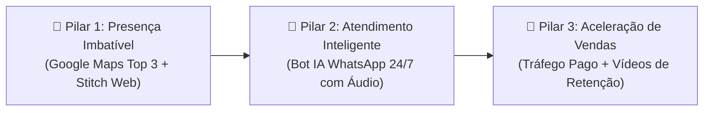

# 📑 Proposta Comercial Oficial — DLuz Digital

> **Referência:** `DLUZ-PROP-2026/01`  
> **Data:** 17 de Setembro de 2026  
> **Validade:** 7 dias corridos  
> **Arquivo Interativo HTML/PDF:** [`proposta-comercial-modelo.html`](file:///c:/Users/dluzgg/Documents/antigravity/serene-newton/proposta-comercial-modelo.html)

---

## 🏢 1. Identificação do Projeto

| Campo | Detalhes |
| :--- | :--- |
| **Cliente / Empresa** | `{{NOME_DA_EMPRESA_CLIENTE}}` |
| **Aos Cuidados de** | `{{NOME_DO_DECISOR_OU_PROPRIETARIO}}` |
| **Localização** | `{{CIDADE_OU_PALMAS}}` — TO |
| **Responsável Técnico** | **DLuz** — Fundador & Diretor de Tecnologia da DLuz Digital |
| **Contato Oficial** | WhatsApp: (63) 99999-9999 |

---

## 🎯 2. Diagnóstico & Oportunidade Identificada

Após análise preliminar da presença digital da sua empresa, mapeamos 3 gargalos críticos que estão impedindo o seu negócio de crescer no ritmo máximo:

1. **Google Maps Desatualizado ou Sem Estratégia de Reviews:**
   * Diariamente, centenas de pessoas na sua cidade e em Palmas pesquisam pelo seu serviço no celular. Por falta de otimização de categorias e termos de busca imediatos, esses clientes acabam contratando o seu concorrente.
2. **Gargalo no Tempo de Resposta no WhatsApp:**
   * Mensagens recebidas em horários de pico, fins de semana ou após o expediente ficam horas sem resposta. No ambiente digital atual, 78% dos clientes fecham com a primeira empresa que responde com clareza.
3. **Falta de Previsibilidade de Vendas:**
   * O faturamento atual oscila dependendo apenas de indicações boca a boca, sem uma máquina ativa de atração de clientes rodando todos os dias.

---

## 🛠️ 3. O Escopo da Solução (Os 3 Pilares DLuz Digital)

### Pilar 1: Dominação no Google Meu Negócio & SEO Local
* Otimização total da ficha da empresa no Google Maps (palavras-chave estratégicas, fotos em alta resolução, categorias e horários).
* Implantação de sistema automatizado de coleta de avaliações 5 estrelas via WhatsApp para consolidar sua empresa no **Top 3 do Google**.

### Pilar 2: Atendente com Inteligência Artificial 24/7 no WhatsApp
* Criação de um atendente virtual com inteligência artificial treinado com todas as informações do seu negócio.
* **Compreensão e Transcrição de Áudios:** o cliente envia áudio e a IA responde educadamente na hora.
* Agendamento automático integrado ao Google Agenda e envio de orçamentos e links de pagamento via Pix.

### Pilar 3: Landing Page Google Stitch & Tráfego Pago de Alta Performance
* Página ultra veloz (nota 95-100 no Google PageSpeed), focada em converter visitantes em mensagens no WhatsApp.
* Campanhas segmentadas no Meta Ads (Instagram/Facebook) e Google Ads atraindo pessoas com real poder de compra na sua região e em Palmas.

---

## 📅 4. Cronograma de Implantação

| Período | Etapa | Entregas |
| :--- | :--- | :--- |
| **Semana 1** | **Diagnóstico & Setup** | Otimização completa da ficha no Google Maps, coleta dos materiais e alinhamento do tom de voz. |
| **Semana 2** | **Construção & Treinamento IA** | Desenvolvimento da Landing Page Google Stitch e treinamento avançado do Bot de IA no WhatsApp. |
| **Semana 3** | **Lançamento & Tráfego** | Conexão do Bot de WhatsApp, ativação das campanhas de tráfego pago e primeiros testes de resposta. |
| **Semana 4** | **Escala & Otimização** | Envio do primeiro relatório quinzenal de métricas, refinamento do custo por lead e plano de expansão. |

---

## 💰 5. Tabela Comparativa de Investimento

| Benefícios / Entregáveis | Opção 01: Start Local | Opção 02: Escala & IA ⭐ *(Recomendado)* | Opção 03: Dominação 360° |
| :--- | :---: | :---: | :---: |
| **Otimização Google Maps Top 3** | Sim | Sim | Sim |
| **Sistema de Reviews 5 Estrelas** | Sim | Sim | Sim |
| **Landing Page Google Stitch** | — | **Inclusa** | **Inclusa** |
| **Bot com IA 24/7 no WhatsApp** | — | **Incluso** | **Incluso** |
| **Gestão de Tráfego Pago** | — | Meta ou Google | Meta + Google Ads |
| **Vídeos Comerciais de Alta Retenção** | — | — | **4 Vídeos/mês** |
| **Relatórios Quinzenais de Vendas** | — | Sim | Sim (Prioritário VIP) |
| **Modelo de Contratação** | Pagamento Único | Mensalidade Recorrente | Projeto Completo Mensal |
| **Valor do Investimento** | **R\$ 697** | **R\$ 1.497 /mês** | **R\$ 2.997 /mês** |

---

## ✍️ 6. Termo de Aceite & Início Imediato

> Para aprovar esta proposta e garantir a vaga da sua empresa antes do preenchimento do limite de clientes por segmento na sua cidade:
> 
> 1. Escolha o plano desejado (Opção 01, 02 ou 03).
> 2. Clique para confirmar via WhatsApp: **[Aprovar Proposta no WhatsApp](https://wa.me/5563999999999?text=Ol%C3%A1%20DLuz!%20Aprovei%20a%20proposta%20comercial%20da%20DLuz%20Digital!)**
> 3. O pagamento de entrada pode ser realizado via **Pix** ou parcelado no **Cartão de Crédito**.
