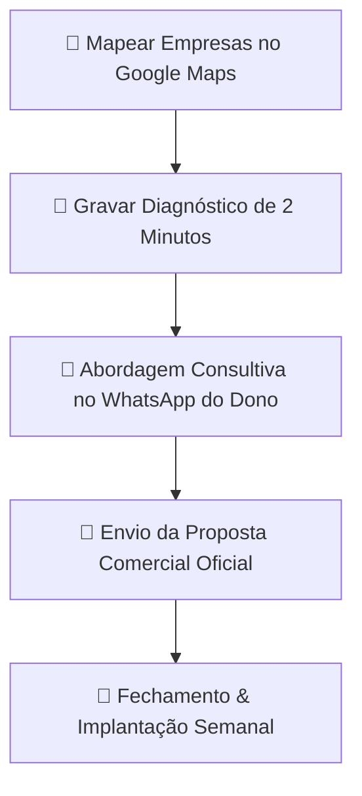

# 🚀 Walkthrough de Lançamento: DLuz Digital — Agência Tech & IA

Este documento resume a execução completa de estruturação e lançamento da **DLuz Digital**, a sua empresa de marketing digital de alta performance, tecnologia e inteligência artificial para empresas locais (50.000 habitantes) e a capital **Palmas - TO**.

---

## 📦 O Que Foi Criado e Entregue

### 1. 🌐 Landing Page Oficial (Padrão Google Stitch)
* **Localização dos Arquivos no Workspace:** `c:\Users\dluzgg\Documents\antigravity\serene-newton\`
  * [`index.html`](file:///c:/Users/dluzgg/Documents/antigravity/serene-newton/index.html) — Landing Page completa, responsiva, ultra veloz, com Tailwind CSS e Dark Mode tecnológico.
  * [`proposta-comercial-modelo.html`](file:///c:/Users/dluzgg/Documents/antigravity/serene-newton/proposta-comercial-modelo.html) — Modelo oficial de proposta comercial com suporte a impressão direta em folha A4 / PDF e botões de aceite via WhatsApp.
* **Seções Principais da Landing Page:**
  * **Header com Glassmorphism:** Logotipo moderno da DLuz Digital com gradiente ciano e dourado.
  * **Hero Section de Alta Conversão:** Chamada persuasiva voltada a faturamento real e combate à lentidão das agências comuns.
  * **Composição Visual 2.5D com DLuz & Frya:** Fotos reais do fundador e a mascote oficial da IA animada em floating.
  * **Catálogo de Serviços 360° (Cards Google Stitch):** Google Meu Negócio, Sites Stitch, Bots IA no WhatsApp, Vídeos Cinéticos HyperFrames, Tráfego Pago e PDFs Interativos.
  * **Simulador de WhatsApp em Tempo Real:** Um mockup interativo de celular onde o cliente clica nas perguntas e a assistente Frya responde instantaneamente, simulando o atendimento com IA.
  * **Seção do Fundador:** Foto em alta definição do DLuz, autoridade comprovada e compromisso com o empresário.
  * **Tabela de Planos:** Planos Start Local (R\$ 697), Escala & IA (R\$ 1.497/mês) e Dominação 360° (R\$ 2.997/mês).

---

### 2. 🖼️ Galeria de Imagens & Assets da Marca
Foram organizadas e inseridas na pasta `assets/img/`:
* `dluz_founder.jpg` — Retrato executivo em alta definição do fundador DLuz.
* `dluz_profile.jpg` — Foto institucional para a seção sobre o fundador.
* `frya_mascote.png` — Imagem oficial da Mascote Frya (Vermelho Escarlate e Amarelo Dourado), atuando como a personificação da IA de atendimento.

---

### 3. 📄 Modelo Oficial de Proposta Comercial Interativa
* **Template HTML / PDF:** [`proposta-comercial-modelo.html`](file:///C:/Users/dluzgg/.gemini/antigravity/scratch/dluz-digital-web/proposta-comercial-modelo.html)
* **Template Markdown:** [Proposta Comercial Modelo](file:///C:/Users/dluzgg/.gemini/antigravity/brain/1f11199d-3a74-4a7b-9791-4fce7c800ba9/proposta_comercial_modelo.md)
* **Características:**
  * Design executivo preto e ciano com badges luminosos.
  * Diagnóstico dos 3 maiores gargalos do negócio.
  * O Escopo em 3 Pilares (Google Maps, Bot IA WhatsApp e Tráfego/Landing Page).
  * Tabela comparativa clara dos 3 pacotes.
  * Botão direto de aprovação no WhatsApp com mensagem personalizada.
  * Campos de assinatura para impressão em PDF.

---

## 🎯 4. Estratégia de Captação & Vendas: Cidade Local (50k hab) + Palmas - TO

### Como Fechar os Primeiros 5 Clientes Locais:
1. **Nicho 1: Clínicas Médicas & Odontológicas:** Sofrem muito com secretárias sobrecarregadas e faltas de pacientes. O **Bot de WhatsApp com IA + Lembretes Automáticos + Google Maps** é uma venda imediata de R\$ 1.497/mês.
2. **Nicho 2: Escritórios de Advocacia & Contabilidade:** Precisam de autoridade, site ultrarrápido (Google Stitch) e qualificação de clientes no WhatsApp.
3. **Nicho 3: Lojas de Materiais de Construção & Móveis:** Precisam de catálogos digitais em PDF e campanhas de Google Maps para quem está construindo/reformando na cidade.
4. **Nicho 4: Concessionárias & Revendas de Carros:** Precisam de anúncios com vídeos rápidos (Reels) mostrando o estoque e atendimento no segundo zero no WhatsApp.

### A Abordagem de Ouro no WhatsApp:
> *"Olá [Nome do Proprietário], tudo bem? Me chamo DLuz, sou diretor de tecnologia da DLuz Digital aqui na região. Estava pesquisando serviços de [Segmento da Empresa] no Google Maps e percebi que sua empresa tem um excelente serviço, mas está perdendo de 20 a 30 clientes por mês porque sua ficha do Google está sem 3 configurações essenciais e seu WhatsApp demora para dar resposta automática aos clientes. Gravei um vídeo rápido de 1 minuto e meio mostrando exatamente onde está esse gargalo. Posso te enviar por aqui sem compromisso nenhum?"*

---

## 🚀 Como Visualizar o Projeto Agora

1. Para abrir e testar a Landing Page no navegador:
   Abra o arquivo [`index.html`](file:///c:/Users/dluzgg/Documents/antigravity/serene-newton/index.html).
2. Para visualizar e testar o Modelo de Proposta Comercial:
   Abra o arquivo [`proposta-comercial-modelo.html`](file:///c:/Users/dluzgg/Documents/antigravity/serene-newton/proposta-comercial-modelo.html).
